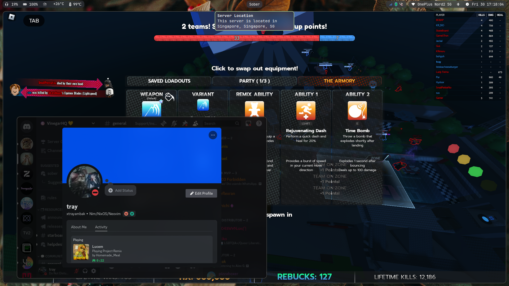
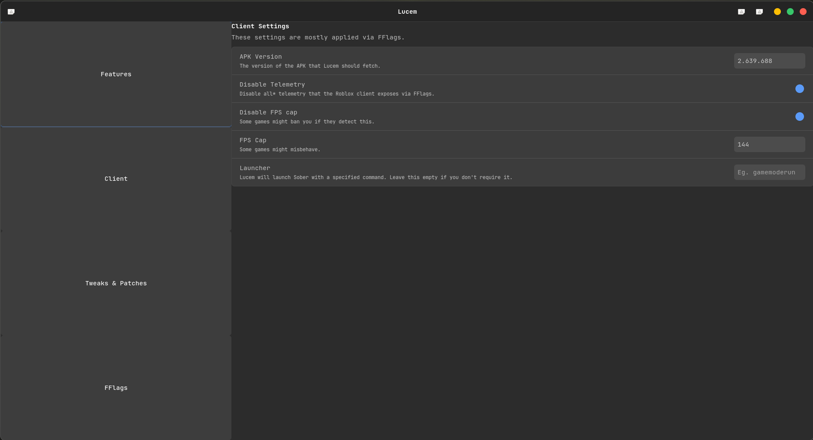
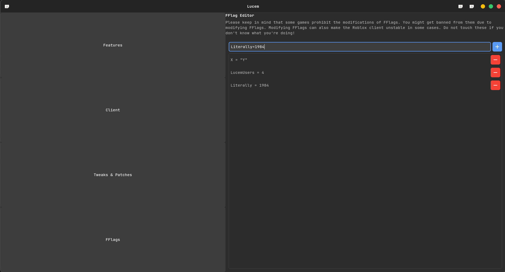
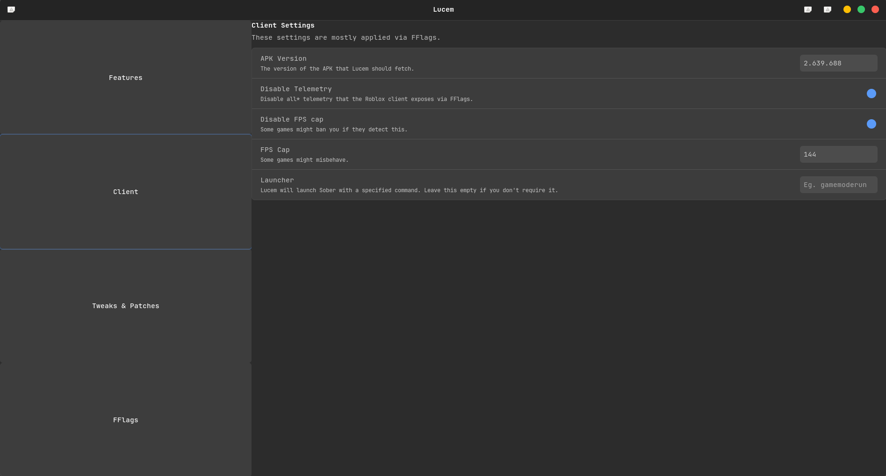
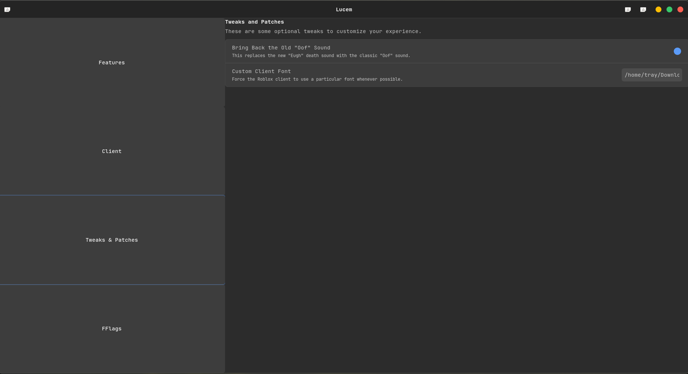

# Lucem
Lucem is a small wrapper over [Sober](https://sober.vinegarhq.org) to provide some QoL improvements. \
Please keep in mind that while Lucem is fully open source software, Sober is proprietary for a very good reason, that being to preserve RoL from 9-year-old skiddies.







# Disclaimer, in big bold letters.
Lucem only automates downloading the Roblox APK from `apkmirror.com`. It does not allow you to bypass the (reasonable and justified) restrictions the Vinegar team has put on Sober's ability to load APKs that are modified.

If you really cheat on Roblox, I'd say you should reconsider your life decisions than anything. \
**Lucem is not associated with the VinegarHQ team or Roblox, nor is it endorsed by them!**

# Features
- GTK4 + Libadwaita GUI to modify settings
- GTK4-based FFlag editor that is easy to use
- Rich presence
- Server region notifier
- If you're not a fan of GUIs, we provide a nifty configuration file that does the same thing! (located at `~/.config/lucem/config.toml`)
- (Semi-automatically) downloading and managing the Roblox APK
- Managing Sober

Whilst not a feature you use directly, Lucem also caches API calls whenever it can in order to save bandwidth and resources.

## Patches
Lucem provides the following optional patches. All of them go under the `tweaks` section in your configuration.

### Bring back the old Oof sound
```toml
oldOof = true
```

### Use another font
Both OTFs and TTFs are supported.
```toml
font = "/path/to/your/font.ttf"
```

# Installation
## Building from source
Lucem requires a working Nim toolchain which can be installed via [choosenim](https://nim-lang.org/install_unix.html)

Run the following commands to compile Lucem.
```command
$ git clone https://github.com/xTrayambak/lucem.git
$ cd lucem
$ nimble install
```

# Submitting bug reports
Please make sure to attach the logs that Lucem generates. Also, please run Lucem with the verbose flag (`lucem run -v`) and submit that log as it contains crucial debugging informationt.

# Usage
## Initializing Sober and Roblox
Run this command:

```command
$ lucem init
```

You will be guided as to how you can download the latest Roblox APK.

## Launching the Lucem GUI
```command
$ lucem shell
```

## Configuring Lucem
```command
$ lucem edit-config
```

This will open the configuration file in your preferred editor. Your configuration will immediately be validated after you exit the editor.

## Launching Roblox
```command
$ lucem run
```

## Check build metadata
```command
$ lucem meta
```

## Fetching a new APK
Edit your configuration with `lucem edit-config` to the version of the APK that you wish to install. **Make sure that Sober supports it! Check their Discord for information.**
```command
$ lucem fetch-apk
```

## Installing Sober
```command
$ lucem install-sober
```

## Clearing API caches
```command
$ lucem clear-cache
```
